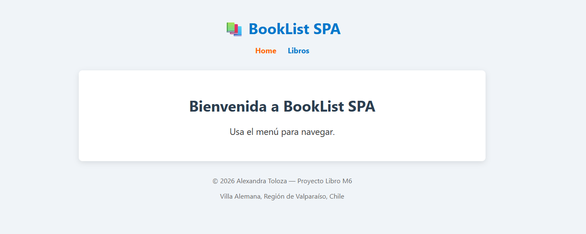
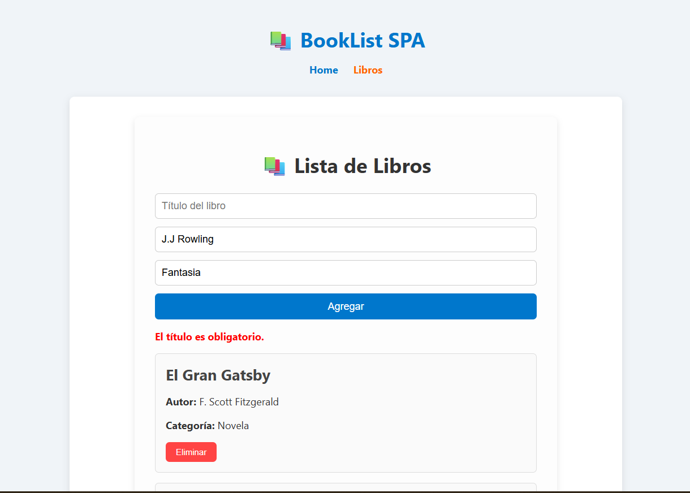
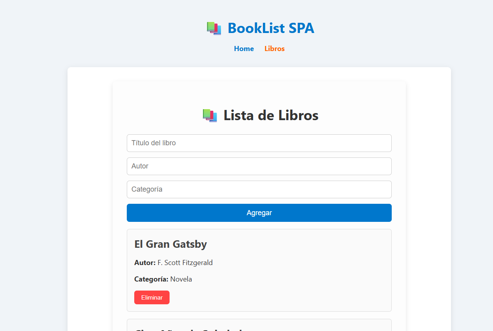
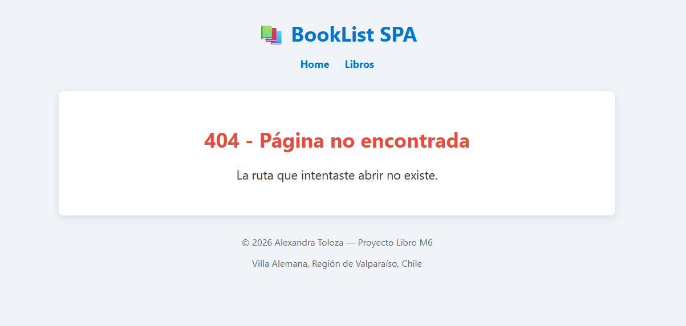

# 📚 BookList SPA

Aplicación web desarrollada en **Vue 3** con `<script setup>` que permite gestionar una lista de libros.  
Los usuarios pueden **agregar** nuevos libros con título, autor y categoría, y también **eliminarlos** de la lista.  
El proyecto incluye un **router** con tres vistas principales: Home, Libros y NotFound.

---

## 🚀 Características
- SPA construida con **Vue 3 + Vue Router**.
- Formulario con validación (el título es obligatorio).
- Lista dinámica de libros con opción de eliminar.
- Estilos personalizados con CSS moderno.
- Footer Personalizado.

---

## 🛠️ Tecnologías utilizadas
- [Vue 3](https://vuejs.org/)  
- [Vue Router](https://router.vuejs.org/)  
- [ESLint](https://eslint.org/) para mantener el código limpio.  
- CSS puro para estilos personalizados.

---

## 📂 Estructura del proyecto
src/
├─ components/
│   └─ libroItem.vue
├─ views/
│   ├─ Home.vue
│   ├─ Libros.vue
│   └─ NotFound.vue
├─ router/
│   └─ index.js
└─ App.vue

---

## ⚙️ Instalación y ejecución
1. Clonar el repositorio:
   ```bash
   git clone https://github.com/Alexandratoloza/Booklist-01.git

## Git Hub Pages
https://alexandratoloza.github.io/Booklist-01/

## Capturas de Pantalla 

### Home


### lista de de libros


### libros


### Error 404

 
